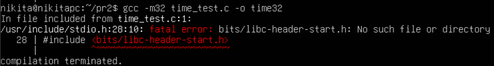
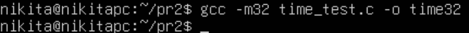
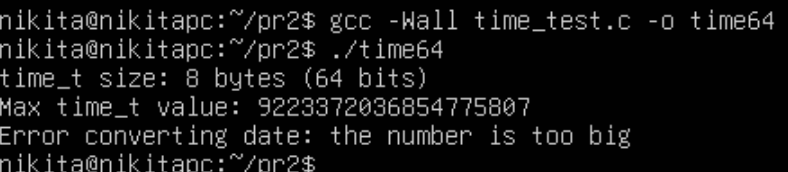
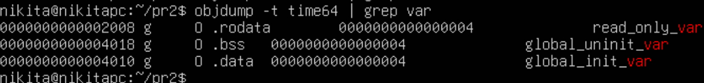
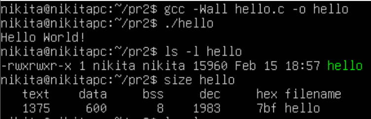
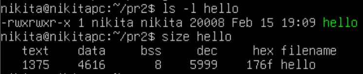
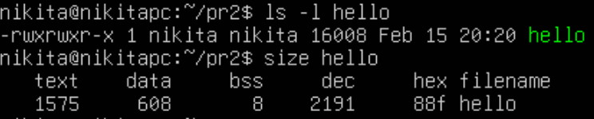
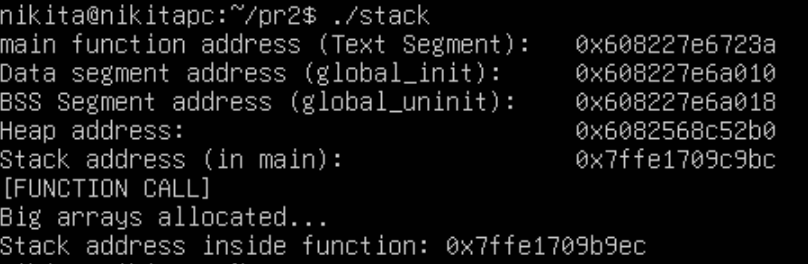
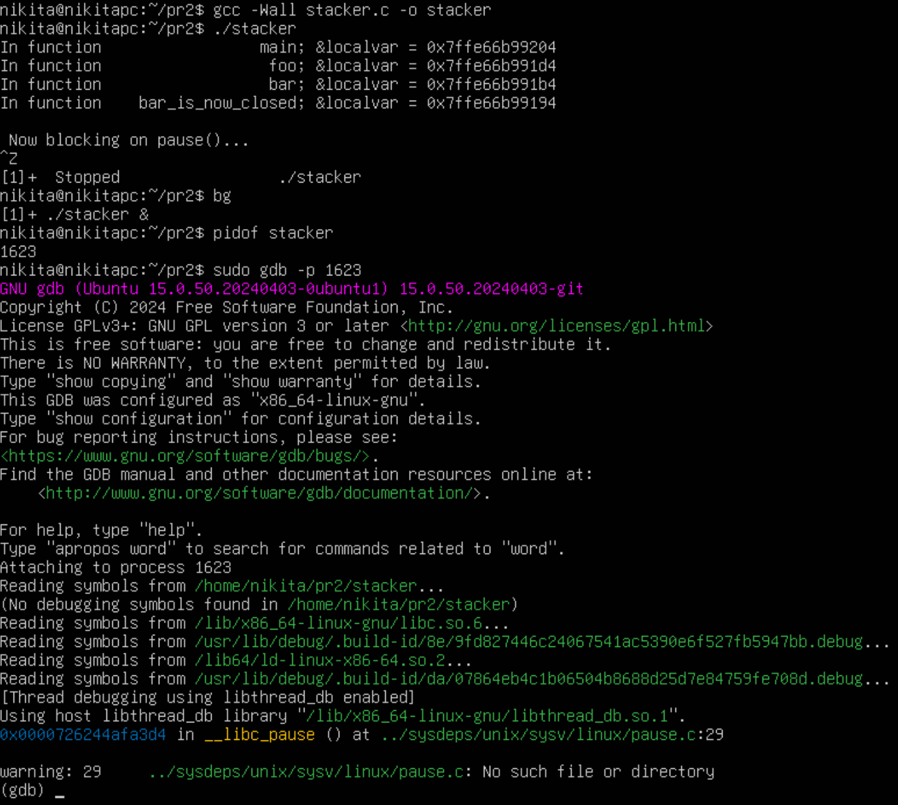

# Практична робота 2

## Загальне завдання

Напишемо програму для визначення моменту, коли time_t
закінчиться. Дослідимо, які зміни відбуваються в залежності від 32- та 64-бітної архітектури, та сегменти виконуваного файлу.

Увійшовши в систему Linux, створемо новий файл `time_test.c`:

```
mkdir pr2
cd pr2
nano time_test.c
```

При спробі скомпілювати файл для 32-бітних систем командою `gcc -m32 time_test.c -o time32`, у Вас, скоріше за все, з'явиться ось така помилка:



Це відбувається, тому що стандартно сучасні Linux-дистрибутиви постачаються лише з 64-бітними версіями бібліотек (libc), тому компілятор не може знайти файли, необхідні для режиму -m32.

Для вирішення цієї проблеми потрібно встановити пакет підтримки мультиархітектурної компіляції (**multilib**). Виконайте команду (для Ubuntu):

```
sudo apt update
sudo apt install gcc-multilib
```

Тепер все має працювати як треба:



Запустимо наш код:
```
./time32
```

і побачимо наступний вивід:


> На 32-бітних системах час скінчиться у січні 2038 року. Це відомо як "Проблема 2038 року" (Y2038). Після цієї секунди лічильник переповниться, стане від'ємним, і дата "стрибне" назад у 1901 рік (або 1970, залежно від реалізації).

Тепер запустимо наш код під 64-бітну архітектуру (стандартно):
```
gcc -Wall time_test.c -o time32
./time64
```
Результат:



> Програма не змогла порахувати граничний час, оскільки на 64-бітних архітектурах цей час перевищує вік Всесвіту. Відповідно, якісь проблеми для майбутніх програмістів навряд-чи виникнуть.

Для **дослідження сегментів** використаємо дві команди:
1. `size` - показує розмір секції
2. `readelf` - показує детальну інформацію

### 1. Команда `size`

Запустіть у терміналі:
```
size time64
```

Ви побачите таблицю значень. Ось що вони означають:

* **text** (Code Segment): Містить машинний код програми (інструкції CPU). Він доступний лише для читання та виконання.

* **data** (Data Segment): Містить ініціалізовані глобальні та статичні змінні.

    * У нашому коді сюди потрапить змінна `int global_init_var = 42;`.

* **bss** (Block Started by Symbol): Містить неініціалізовані глобальні та статичні змінні. Вони автоматично заповнюються нулями при старті програми.

    * У нашому коді сюди потрапить змінна `int global_uninit_var;`.

    * *Цікавий факт*: Цей сегмент не займає місця у самому файлі на диску (лише розмітка), але займає пам'ять в RAM під час запуску.

### 2. Команда `objdump`

Виконавши наступну команду, ми зможемо побачити в яких секціях зберігаютсья наші змінні:
```
objdump -t time64 | grep var
```

Результат:



Тут наглядно видно, як кожна змінна попадає до відповідної категорії:
* `.rodata`: константи.
* `.bss`: Неініціалізовані змінні (занулені).
* `.data`: Ініціалізовані змінні.

## Завдання 2.2

1. Скомпілюємо програму `"hello world"`, запустимо `ls -l` для
виконуваного файлу, щоб отримати його загальний розмір, і
запустимо `size`, щоб отримати розміри сегментів всередині нього.



2. Додайте оголошення глобального масиву із 1000 int,
перекомпілюйте й повторіть вимірювання.


Загальний розмір майже не змінився, а от розділ `.bss` (неініціалізовані зміни) збільшився досить помітно рівно на розмір нашого масиву (1000*4 байт).

**Висновок**: сегмент BSS не зберігається у виконуваному файлі (за винятком примітки щодо його вимог до розміру часу виконання).

3. Тепер додамо початкове значення в оголошення масиву. Це перемістить масив із сегмента BSS у сегмент даних:



Збільшився і загальний розмір виконуваного файлу.

**Висновок**: сегмент даних зберігається у виконуваному файлі.

4. Тепер додамо оголошення великого масиву в локальну функцію.
Оголосимо другий великий локальний масив з ініціалізатором.
Повторимо вимірювання:



Сегменти data та bss стали маленькими (як у кроці 1). Вони не містять локальних змінних. Сегмент text (код) трохи зріс.

Чому так?

Локальні змінні живуть на Стеку (Stack). Стек створюється динамічно під час роботи програми, тому він не займає фіксованого місця у size (який показує статичні сегменти).

Значення локального масиву також мають десь зберігатися. Зазвичай вони зберігаються в секції .rodata (read-only data) або вшиті в інструкції машинного коду (text), і при запуску функції main програма копіює їх у стек. Тому ми бачимо невелике зростання text, але не data.

5. Вплив прапорців компіляції

Скомпілюємо програму для налагодження та повторимо вимірювання.
```
gcc -g hello.c -o hello_debug
ls -l hello_debug
size hello_debug
```


Результат: Розмір файлу (`ls -l`) стане значно більшим (у кілька разів). Так відбувається, тому що додається таблиця символів для дебагера (GDB), яка пов'язує машинний код з рядками нашого вихідного коду.

А Команда `size` ігнорує налагоджувальні секції, показуючи лише ті, що завантажуються в пам'ять, тому вивід `size` не змінився, на відміну від `ls -l`.

**Висновок**: на розмір вихідного файлу впливає компіляція для налагодження, але не сегменти.

Скомпілюємо програму з третім рівнем оптимізації:
```
gcc -O3 hello.c -o hello_opt
```


Розмір файл та його сегментів змінився. Якщо ми оголосили масив, але не використовуємо його, розумний компілятор з -O3 може просто видалити його з коду.

Код функцій стає компактнішим або, навпаки, розгортається (inlining) для швидкості.

**Висновок**: текстовий сегмент більшою мірою піддається перевіркам
оптимізації

## Завдання 2.3

Скомпілюємо й запустимо наступну тестову програму, щоб визначити приблизне розташування верху стека в нашій системі:

```
#include <stdio.h>

int main() {
    int i;
    printf("The stack top is near %p\n", &i);
    return 0;
}
```

Знайдемо розташування сегментів даних і тексту, а також купи всередині сегмента даних, оголосимо змінні, які будуть поміщені в ці сегменти, і виведемо їхні адреси.

Збільшимо розмір стека, викликавши функцію й оголосивши кілька
великих локальних масивів.


Скомпілюємо та запустимо програму `stack.c` (див. у файлах).



Відповідно до виводу сегменти розташовується так:
```
Stack
↑
Heap
↑
Data
↑
Text Segment
```

Що сталося зі стеком після виклику функції?

Адреса стала меншою.

**Висновок**: На архітектурі x86/x64 стек росте вниз (від високих адрес до низьких). Коли ми викликали функцію stack_growth_test і оголосили там великі масиви, система відняла необхідний обсяг пам'яті від поточного вказівника стека (Stack Pointer), щоб звільнити місце для нових змінних. Тому адреса "вершини" стека зменшилася.

## Завдання 2.4

Дослідимо стек процесу.

Запустимо програму `stacker.c` (див. у файлах), зупинимо її (`CTRL+Z`), відправимо у фонове виконання (`bg`), дізнаємось PID процесу (`pidof stacker`) та дослідимо процес за допомогою GDB:



## Завдання 2.5

>Відомо, що при виклику процедур і поверненні з них процесор використовує стек. Чи можна в такій схемі обійтися без лічильника команд (IP), використовуючи замість нього вершину стека? Обґрунтуйте свою відповідь та наведіть приклади.

Теоретично — так, це можливо. Існують архітектури та методи виконання коду, де роль лічильника команд (IP/PC) виконує верхівка стека.
Практично (у сучасних процесорах x86/ARM) — ні. Це було б катастрофічно неефективно для продуктивності та зробило б обладнання надзвичайно складним.

## Завдання для варіанта 13

> Дослідіть вплив оптимізації -Os на розмір сегментів.

Проведемо експеримент і подивимося, як `-Os` "стискає" виконуваний файл порівняно з режимом швидкості `-O3` та режимом без оптимізації `-O0`.

Щоб побачити різницю, нам потрібен код, який компілятор зазвичай намагається "розгорнути" (unroll) або вбудувати (inline) заради швидкості. Візьмемо для цього код програми `size_opt.c` (див. у файлах).

Скомпілюємо програму з трьома режимами оптимізації:

1. Без оптимізації
```
gcc -O0 size_opt.c -o size_none
```
2. Швидкість (агресивна)
```
gcc -O3 size_opt.c -o size_speed
```
3. Розмір (компактна)
```
gcc -Os size_opt.c -o size_small
```

Тепер порівняємо усі 3 режими:
```
size size_none size_speed size_small
```

В результаті маємо:


**Висновок**

Оптимізація -Os:
1. Зменшує сегмент .text: Це її головна ціль.
2. Майже не впливає на .data та .bss: Глобальні змінні займають стільки місця, скільки їм потрібно, незалежно від алгоритму (хіба що компілятор помітить, що змінна не використовується, і видалить її).