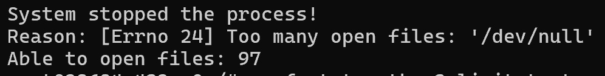
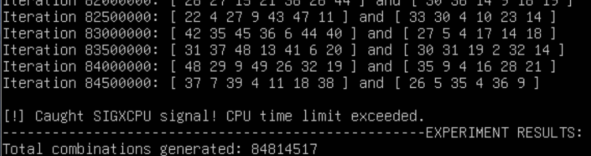
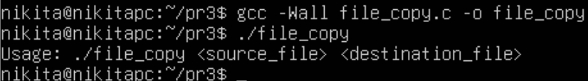
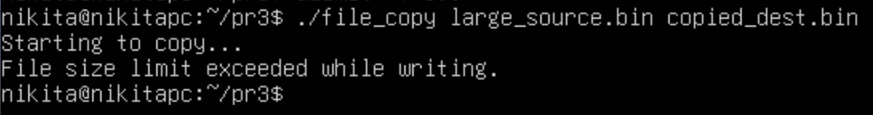
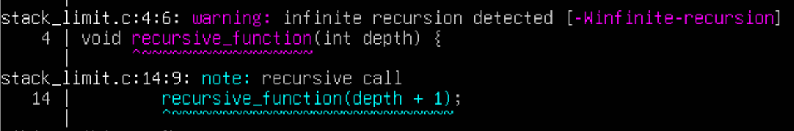
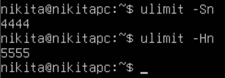

# Практична робота 3

## Загальне завдання

### Завдання 3.1

Спочатку завантажимо та встановимо Docker Desktop з офіційного веб-сайту: https://docs.docker.com/desktop/#next-steps.

Після встановлення переконаємося, що програма встановлена, запустивши командний рядок та виконавши команду `docker -v`. Має вивестись версія Docker.

Далі для виконання завдання наступну команду, вказавши як ID звичайного користувача '1000':
```
docker run -it --user 1000 ubuntu bash
```
Це запустить контейнер із звичайними правами (не root).

Далі по черзі виконаємо команди:
```
$ ulimit -n
$ ulimit -aS | grep "open files"
$ ulimit -aH | grep "open files"
$ ulimit -n 3000
$ ulimit -aS | grep "open files"
$ ulimit -aH | grep "open files"
$ ulimit -n 3001
$ ulimit -n 2000
$ ulimit -n
$ ulimit -aS | grep "open files"
$ ulimit -aH | grep "open files"
$ ulimit -n 3000
```

Введіть `exit`, щоб вийти з контейнера.

Тепер виконаємо ті самі команди з правами root:

```
docker run -it --cap-add=SYS_RESOURCE ubuntu bash
```

Коли ми вводимо `ulimit -n 3000` (без прапорців `-S` або `-H`), система знизила і м'який (Soft), і жорсткий (Hard) ліміти до 3000. Звичайний користувач може вільно знижувати жорсткий ліміт, але ніколи не може його підвищити. Тому спроба підняти його до 3001 закономірно видала помилку Operation not permitted.

В той же час користувач з правами root може підвищувати ці ліміти.

### Завдання 3.2

> Важливе уточнення: Оскільки ми використовуємо Docker Desktop, наш контейнер працює на базі віртуального ядра WSL2. Утиліта `perf` жорстко прив'язана до версії ядра системи. У межах Docker Desktop повноцінно запустити perf майже неможливо.

Спочатку встановимо базовий інструментарій включно з `perf` (з правами root):
```
apt-get update
apt-get install -y linux-tools-common linux-tools-generic python3
```

*(python3 знадобиться далі).*

**Крок 1: Встановлюємо низький ліміт для поточного сеансу**

```
ulimit -n 100
```

**Крок 2: Запускаємо процес, який спробує відкрити більше файлів**

Скопіюйте та вставте цю команду в термінал контейнера. Вона створить файл `limit_test.py`:

```
cat << 'EOF' > limit_test.py
import sys

files = []
try:
    for i in range(5000):
        files.append(open("/dev/null", "r"))
except OSError as e:
    print(f"\nSystem stopped the process!")
    print(f"Reason: {e}")
    print(f"Able to open files: {len(files)}")
EOF
```

Запустимо скрипт:
```
python3 limit_test.py
```

Скрипт миттєво зупиниться і видасть помилку:



Як бачимо, система обмежує ресурси процесу відповідно до встановленого ліміту.

### Завдання 3.3

Виконаємо цю вправу вже в Ubuntu, встановленій на віртуальну машину на минулій практичній роботі.

Створимо файл `dice_limit.c` (див. у файлах). Скомпілюємо та запустимо його:
```
gcc -Wall dice_limit.c -o dice_limit
./dice_limit
```

Результат:


При спробі запису у файл, який досяг максимально дозволеного розміру, ядро ОС генерує сигнал `SIGXFSZ`. Програма успішно зареєструвала обробник цього сигналу, що запобігло аварійному завершенню процесу, та штатно обробила системну помилку `EFBIG`, зберігши всі дані, записані до моменту переривання.

### Завдання 3.4

Скомпілюємо та запустимо файл `lottery_limit.c`.

**Результат**:



Програма встановить ліміт процесорного часу рівно в 1 секунду. Вона почне максимально швидко генерувати випадкові унікальні комбінації. Залежно від потужності процесора, вона встигне згенерувати кілька мільйонів комбінацій. Щойно ядро Linux зафіксує, що процес спожив 1 секунду чистого часу CPU, воно надішле сигнал `SIGXCPU`. Програма його перехопить, безпечно вийде з нескінченного циклу `while` та виведе загальну кількість згенерованих лотерейних білетів.

### Завдання 3.5

Для виконання цього завдання скомпілюємо та запустимо файл `file_copy.c`.



Щоб протестувати переривання копіювання, нам знадобиться файл-джерело певного розміру та встановлений ліміт у командній оболонці.

Створимо тестовий файл розміром 2 мегабайти, заповнений нулями:
```
dd if=/dev/zero of=large_source.bin bs=1M count=2
```

Встановимо жорсткий ліміт на розмір створюваних файлів в 1 мегабайт (1024 байти):

```
ulimit -f 1024
```

Запустимо програму, передавши в аргументи назви файлів:


```
./file_copy large_source.bin copied_dest.bin
```



Програма почне копіювати дані з large_source.bin. Як тільки розмір файлу copied_dest.bin досягне 1 МБ, операційна система надішле сигнал. Програма перехопить його, виведе повідомлення "File size limit exceeded while writing.", коректно закриє обидва файли та завершить роботу, зберігши той 1 МБ даних, який встигла скопіювати.

### Завдання 3.6

Якщо рекурсія нескінченна, вільне місце закінчується. У цей момент програма досягає ліміту, і операційна система надсилає їй сигнал (Segmentation fault), примусово вбиваючи процес.

Щоб продемонструвати це максимально наочно, я написав програму `stack_limit.c` (див. файли), яка рахує "глибину" рекурсії. На кожному кроці вона штучно створює масив на 10 Кілобайт, щоб стек переповнився швидше.

Якщо ми її скомпілюємо з прапорцем `-Wall` компілятор вже нас попередить про рекурсію:



На прикладі рекурсивної функції продемонстровано, що кожен вкладений виклик виділяє нову пам'ять у стековому сегменті. При вичерпанні встановленого ліміту операційна система генерує сигнал, що призводить до штатного аварійного завершення процесу (Segmentation fault).

## Завдання для варіанта 13

> Дослідити зміну обмежень ресурсів через /etc/security/limits.conf.

Щоб зробити обмеження постійними (на відміну від `ulimit`) і щоб вони застосовувалися до користувача відразу під час входу в систему, Linux використовує конфігураційний файл `/etc/security/limits.conf`.

Прописавши наступні команди, можемо побачити, що за замовчуванням лімити встановлені 1024 для м'якого і 1048576 для жорсткого:

```
ulimit -Sn
ulimit -Hn
```

Внесемо зміни в конфігураційний файл:

```
sudo nano /etc/security/limits.conf
```

Додамо в кінець файлу "нестандартні" числа (для наочності), наприклад, 4444 та 5555:

```
* soft    nofile      4444
* hard    nofile      5555
```

Перезапустимо систему:

```
sudo reboot now
```

Як бачимо лімити змінились відповідно:



**ВАЖЛИВО**: Обов'язково видаліть останні додані нами два рядки після експерименту, щоб вони не заважали у майбутньому працювати з Ubuntu.

**Висновок**: Досліджено механізм глобального керування ресурсами через конфігураційний файл `/etc/security/limits.conf`. Встановлено, що на відміну від команди `ulimit`, яка діє лише в межах поточного сеансу оболонки, налаштування у цьому файлі забезпечують перманентне збереження лімітів.