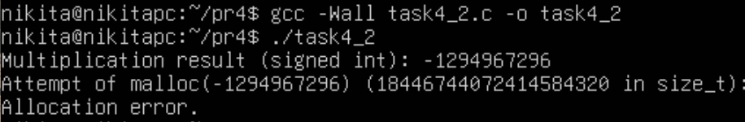
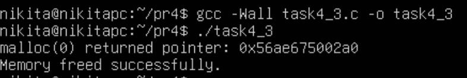
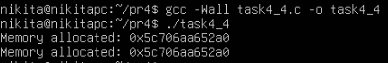
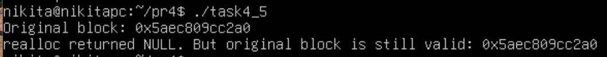
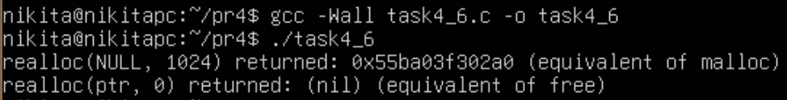
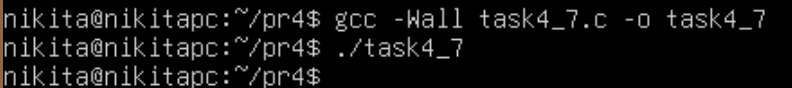
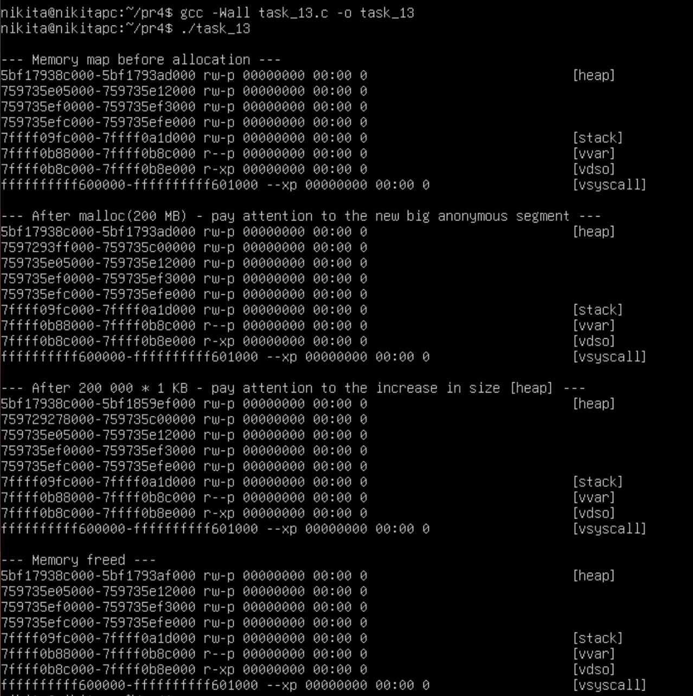

# Практична робота 4

## Загальне завдання

### Завдання 4.1

**Чому теоретичний максимум 8 ЕБ, а не 16 ЕБ?**

Тип `size_t` на 64-бітних системах дійсно може вмістити значення до 264 -1 байтів (близько 16 ексабайтів). Проте архітектура операційних систем (зокрема Linux) ділить віртуальний адресний простір навпіл. Нижня половина виділяється для простору користувача (user space), а верхня — для ядра (kernel space). Тому процес користувача теоретично має доступ лише до половини адрес, тобто 263 байтів (8 ЕБ). Крім того, на сучасних процесорах x86_64 апаратно підтримується лише 48 або 57 біт для адресації, що робить реальний доступний простір ще меншим, а також діють жорсткі ліміти `ulimit`.

### Завдання 4.2

Скомпілюємо і запустимо програму `task4_2.c`:

Параметр `malloc` має тип `size_t` (беззнакове ціле). Якщо передати від'ємне число, воно неявно перетвориться на величезне беззнакове число (близько до `SIZE_MAX`). Це призведе до відмови `malloc`.

### Завдання 4.3

Стандарт C каже, що поведінка `malloc(0)` залежить від реалізації. У бібліотеці `glibc` (яка використовується в Ubuntu) `malloc(0)` повертає унікальний вказівник, який не дорівнює `NULL` і який можна успішно передати у `free()`. Це мінімальний блок пам'яті (зазвичай 16 або 32 байти внутрішньої структури).

Як бачимо, програма виконалась успішно.

### Завдання 4.4

Так, в даному прикладі є проблема: Після `free(ptr)` вказівник не обнуляється (залишається "висячим"). На другій ітерації циклу умова `if (!ptr)` буде хибною, `malloc` не викличеться, програма спробує використати вже звільнену пам'ять (Use-After-Free), а потім спробує звільнити її вдруге (Double Free), що призведе до крашу (`Aborted (core dumped)`).

**Правильний варіант** представлений у файлі `task4_4.c`. Результат:

### Завдання 4.5

Якщо `realloc` не може збільшити блок, він повертає `NULL`, але не видаляє старий блок (`task4_5.c`):

### Завдання 4.6

- `realloc(NULL, size)` працює абсолютно так само, як `malloc(size)`.
- `realloc(ptr, 0)` у `glibc` працює як `free(ptr)` і повертає NULL.

Це демонструє програма `task4_6.c`:

### Завдання 4.7

`reallocarray` безпечно множить два аргументи (`nmemb * size`), перевіряючи, чи не відбудеться цілочисельного переповнення, що є частою вразливістю. Програма `task4_7.c` виконується успішно:

## Завдання для варіанта 13

> Порівняти алокацію великого блоку (200 МБ) і багатьох малих (200 000 × 1 КБ) через /proc/self/maps.

Тут суть полягає в тому, що `malloc` під капотом використовує два різні системні виклики залежно від розміру:

1. Для маленьких блоків використовується `brk()`, який розширює сегмент купи (heap).

2. Для великих блоків (за замовчуванням > 128 КБ) використовується `mmap()`, який створює нове анонімне відображення пам'яті за межами купи.

Програма `task_13.c` робить обидві алокації та виводить фрагменти карти пам'яті.

### Висновок

Під час виконання практичної роботи було досліджено низькорівневі механізми динамічного виділення пам'яті в ОС Linux мовою C. Практично доведено важливість коректного оброблення крайових випадків (переповнення розміру, нульові аргументи, відмова `realloc`) для запобігання витокам пам'яті та критичним помилкам (Double Free, Use-After-Free). За допомогою аналізу карти пам'яті процесу також підтверджено, що системний алокатор оптимізує роботу з ресурсами: для малих блоків використовується розширення сегмента купи, а для великих (наприклад, 200 МБ) — створюються окремі анонімні відображення (`mmap`).