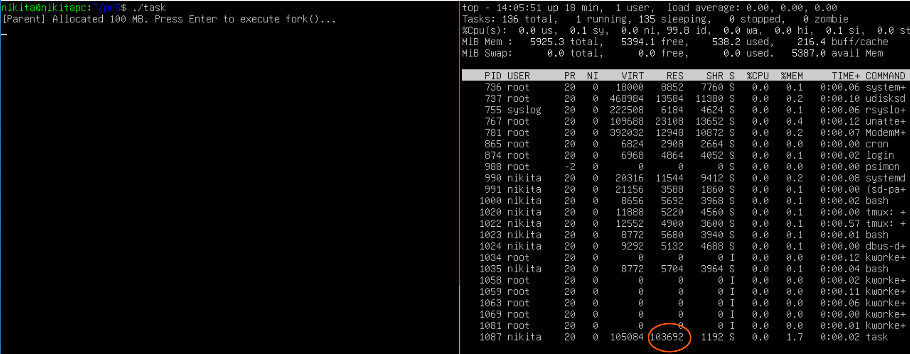
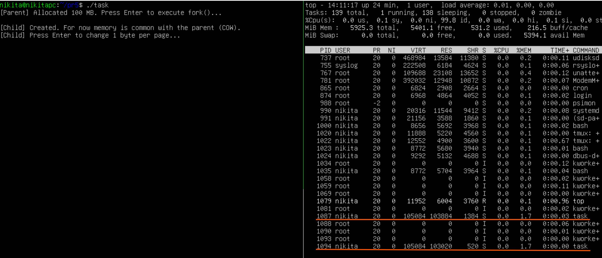
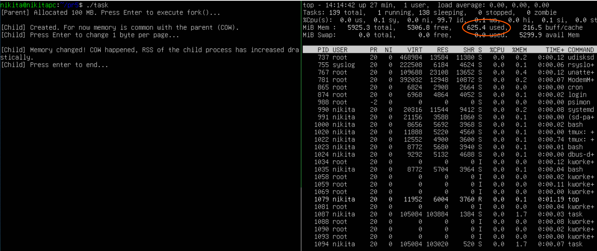

# Практична робота 5

## Варіант 13

### Завдання

Змоделювати COW-поведінку після fork(), де зміна одного байта призводить до різкого зростання RSS.

### Розв'язання

**Що таке COW (Copy-On-Write)?**

Механізм Copy-On-Write (копіювання під час запису) означає, що коли процес викликає функцію fork(), операційна система не копіює всю пам'ять одразу. Батьківський та дочірній процеси спочатку використовують одні й ті самі фізичні сторінки пам'яті. Але як тільки один із процесів намагається змінити хоча б один байт на сторінці, ОС створює копію всієї сторінки для цього процесу. Це і призводить до зростання RSS (обсягу фізичної оперативної пам'яті, яку використовує процес).

Демонстраційна програма представлена у файлі `task.c`.

Для того щоб прослідкувати за виконанням програми скористаємось утилітою 'tmux'.

Встановлення:

```
sudo apt update && sudo apt install tmux
```

Запустіть утиліту:

```
tmux
```

Розділіть екран, натиснувши спочатку `Ctrl+B`, а потім натиснувши `%`. Для перемикання між вікнами натисніть `Ctrl+B` та відповідну стрілку.

В одному вікні запустимо нашу програму, а в іншому запустимо монітор ресурсів:

```
# Вікно 1
./task
```

```
# Вікно 2
top
```

**Етап 1**


Програма виділила пам'ять і заповнила її. ОС виділила реальні фізичні сторінки для цього процесу (100 MB).

**Етап 2**


У списку два процеси task з різними PID. RES (RSS): В обох процесів - 100 MB.
Системна пам'ять (used): НЕ ЗМІНИЛАСЯ порівняно з Етапом 1.

Це і є "магія" Copy-On-Write. Хоча дочірній процес звітує про 100 МБ, він насправді використовує ті самі фізичні сторінки, що й батьківський. ОС не копіює дані, поки вони не змінені, тому загальне споживання RAM не зросло.

**Етап 3**


RES (RSS): В обох процесів все ще по 100 MB.

Системна пам'ять (used): різко зросла ще на ~100 МБ.

Дочірній процес змінив по одному байту на кожній сторінці. Це змусило ядро Linux скопіювати кожну 4-кілобайтну сторінку, щоб у дитини була своя копія. Тепер обидва процеси займають реальні 100 МБ кожен, і сумарне навантаження на систему подвоїлося.

Натиснувши ще раз клавішу `Enter`, обидва процеси завершуться.

**Висновки**: У ході виконання завдання було змодельовано та досліджено механізм Copy-On-Write (COW) в операційній системі Linux. Сучасні операційні системи розумно виділяють ресурси для процесів. Механізм COW дозволяє миттєво створювати нові процеси з мінімальними витратами ресурсів, проте активний запис у пам'ять після fork() може призвести до швидкого вичерпання RAM.
