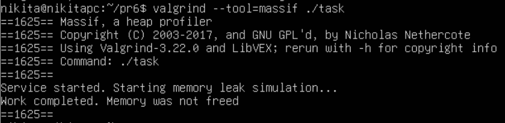
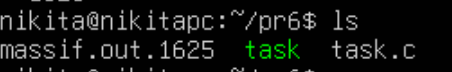
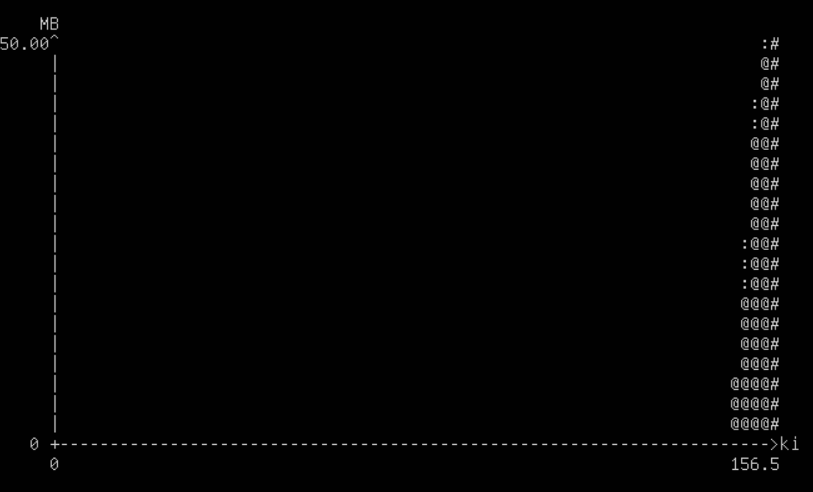
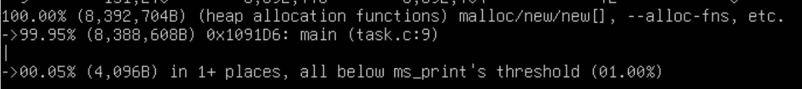

# Практична робота 6

## Варіант 13

### Завдання

Розробити сервіс із поступовим витоком пам’яті та виконати профілювання використання купи за допомогою Valgrind massif.

### Розв'язання

Щоб змоделювати поступовий витік пам'яті, нам потрібен цикл, який регулярно виділяє пам'ять у купі (heap), але "забуває" її звільняти.

Програма `task.c` імітує сервіс, який кожні 0.1 секунди виділяє 1 мегабайт пам'яті і не звільняє її.

Додамо утиліту `valgrind` в нашу систему:

```
sudo apt upgrade && sudo apt install valgrind
```

Скомпілюємо програму із прапорцем `-g` для відображення інформації для відлагодження:

```
gcc -g task.c -o task
```

Запустимо програму під наглядом профайлера Massif:

```
valgrind --tool=massif ./task
```



Після завершення роботи програми у вашій директорії з'явиться файл з назвою формату `massif.out.<PID>` (`PID` можете одразу побачити на екрані).



Для перегляду файлу запустіть перегляд за допомогою утиліти `ms_print`. Також використайте команду `|& less`, щоб результат можна було прокручувати:

```
ms_print massif.out.1625 |& less
```

Можемо побачити графік:



- Вісь X показує час (або кількість виконаних інструкцій).
- Вісь Y показує обсяг виділеної пам'яті.

Графік матиме форму висхідних сходів, що йдуть вгору. Це класичний патерн витоку пам'яті: з плином часу споживання купи постійно зростає, оскільки пам'ять виділяється (`malloc`), але ніколи не повертається системі (`free`).

Під графіком бачимо детальний звіт (дерево викликів), де Massif прямо вкаже на функцію `main` і рядок коду з `malloc`, який є винуватцем зростання купи:



### Висновки

У ході виконання практичної роботи було успішно змодельовано роботу сервісу з поступовим витоком динамічної пам'яті та проведено його аналіз.

Невиконання операції звільнення пам'яті у циклі призводить до безперервного зростання споживання ресурсів, що є критичним для довготривалих сервісів.

Valgrind Massif - надійний засіб для профілювання купи. Він дозволяє робити регулярні "знімки" стану пам'яті під час виконання програми.

Візуалізація та пошук помилки: За допомогою утиліти ms_print було отримано наочний графік, який чітко підтверджує наявність витоку. Крім того, детальний звіт Massif дозволив точно локалізувати проблему — вказати на конкретну функцію та рядок коду, де відбувається втрата контролю над виділеною пам'яттю.
