# Практична робота 7

## Загальні завдання

### Задача 1

Програма демонструє міжпроцесну взаємодію за допомогою функції `popen()`. Створюються два потоки: один зчитує вивід команди `who`, а інший записує ці дані на стандартний ввід утиліти `more`. Це програмний аналог shell-команди `rwho | more`.

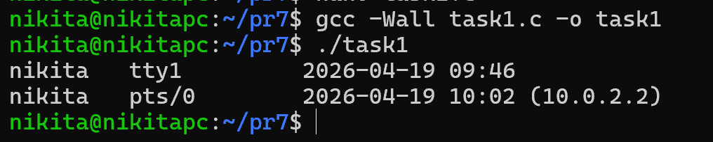

### Задача 2

Утиліта є аналогом `ls -l`. Вона використовує системні виклики `opendir()` та `readdir()` для отримання списку файлів, а також `stat()` для отримання метаданих (розмір, права доступу, власник, час модифікації). Для перетворення UID та GID у текстові імена використовуються `getpwuid()` та `getgrgid()`.

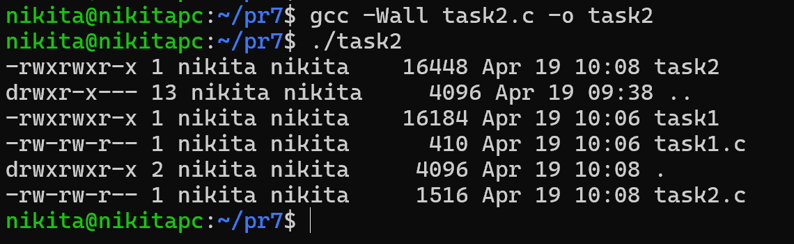

### Задача 3

Спрощена реалізація `grep`. Програма порядково зчитує вказаний файл за допомогою `fgets()` та перевіряє наявність ключового слова у кожному рядку, використовуючи функцію пошуку підрядка `strstr()`.

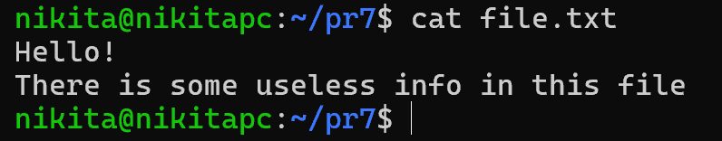

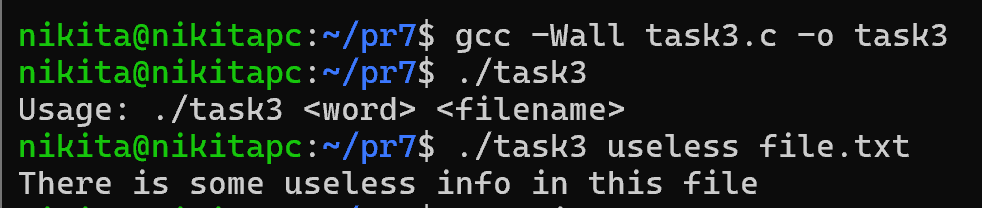

### Задача 4

Спрощена версія утиліти `more`. Зчитує один або кілька файлів, переданих через аргументи командного рядка. Ведеться підрахунок виведених рядків: щоразу, коли кількість досягає 20, програма призупиняється та чекає введення користувача (`getchar()`).

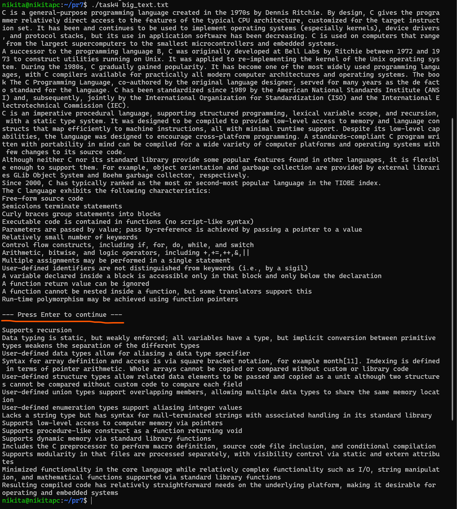

### Задача 5

Програма рекурсивно обходить поточний каталог та всі його підкаталоги. Використовує власну рекурсивну функцію `list_dir()`. Для кожного об'єкта перевіряється, чи є він каталогом (через макрос `S_ISDIR`), щоб прийняти рішення про занурення вглиб структури.

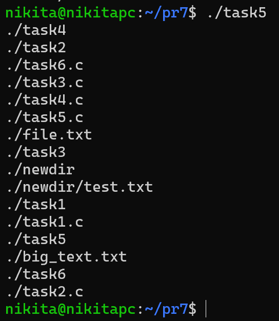

### Задача 6

Перелічує виключно підкаталоги у поточному каталозі, сортуючи їх за алфавітом. Замість базового `readdir()` використовується функція `scandir()` із вбудованим фільтром сортування `alphasort`.

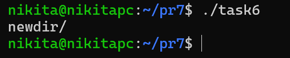

### Задача 7

Програма шукає файли з розширенням `.c` у поточному каталозі. Для знайдених файлів запитує підтвердження у користувача та застосовує системний виклик `chmod()`, додаючи біт `S_IROTH` (читання для інших користувачів).

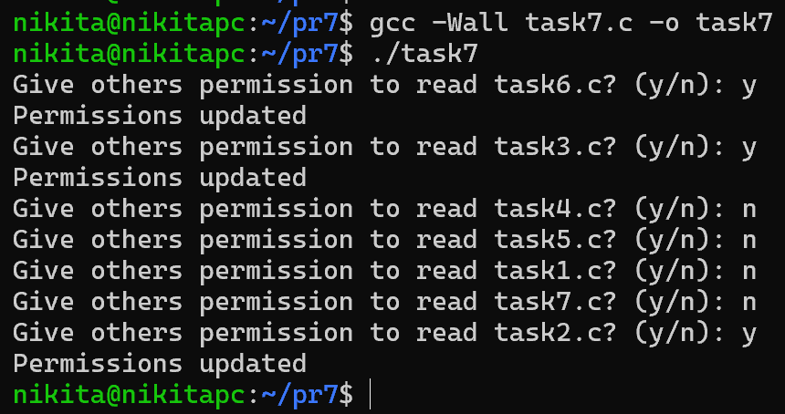

### Задача 8

Реалізує інтерактивне видалення (простий аналог `rm -i`). Перебирає всі звичайні файли (відкидаючи каталоги завдяки макросу `S_ISREG`) і при позитивній відповіді користувача видаляє файл системним викликом `unlink()`.

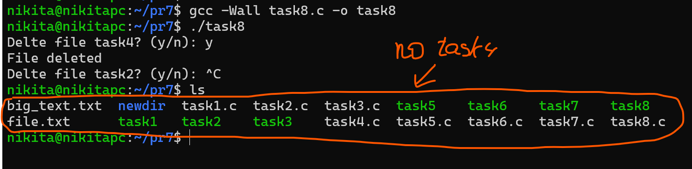

### Задача 9

Вимірює час виконання блоку коду з точністю до мілісекунд. Використовує структуру `timeval` та функцію `gettimeofday()`, яка повертає час у секундах та мікросекундах з епохи UNIX, після чого значення конвертуються у мілісекунди.

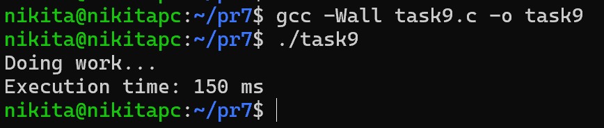

### Задача 10

Генерує випадкові числа з плаваючою комою. Унікальність послідовності при кожному запуску забезпечується функцією `srand()`, яка ініціалізує генератор поточним системним часом `time(NULL)`. Числа формуються шляхом ділення результату `rand()` на системну константу `RAND_MAX`.

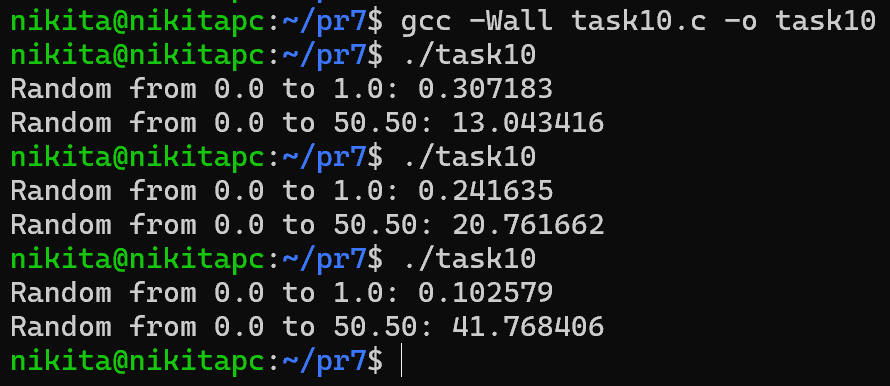

## Завдання по варіантах

### Варіант 13

> _Напишіть утиліту, яка визначає "аномальні" виконувані файли в системі._

З точки зору безпеки аномальними виконуваними файлами вважаються:

1. **Файли зі встановленими SUID або SGID бітами**: Якщо такий файл належить `root`, будь-який користувач, що його запустить, отримає права суперкористувача на час виконання.

2. **Файли, доступні для запису всім (World-writable), але при цьому виконувані**: Будь-хто може змінити код програми, а потім хтось інший (можливо, адміністратор) її запустить.

**Створення файлу з SUID:**

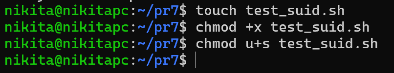

**Створення файлу з SGID:**

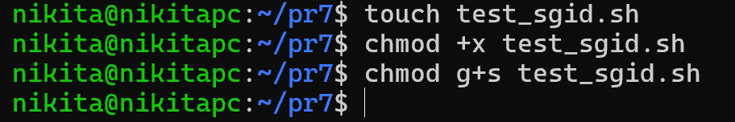

**Створення файлу, відкритого для запису всім:**

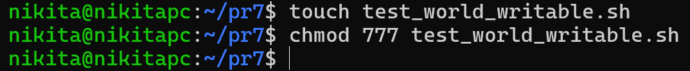

Подивимось на новостворені файли:

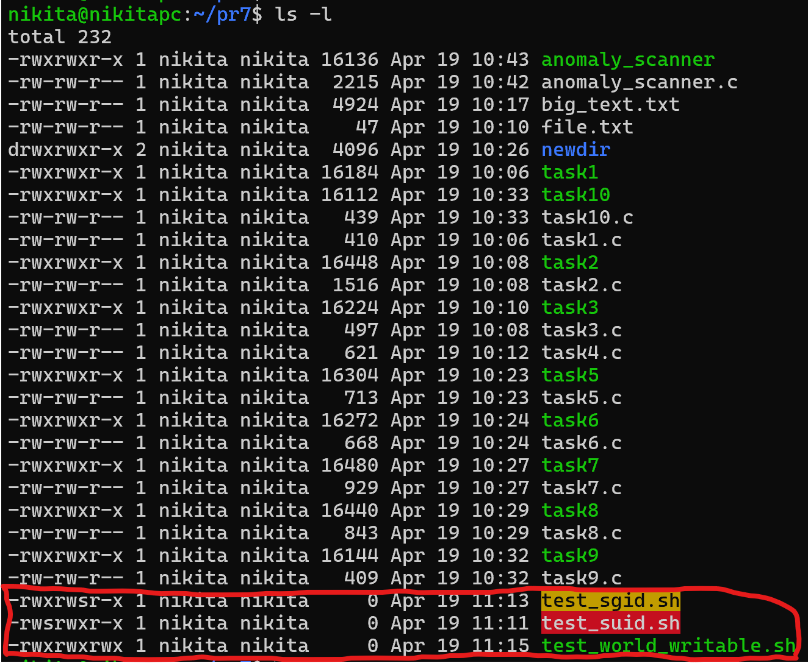

**Бачимо такі особливості:**

- Для SGID-файлу літера `s` у другому блоці: -rwxr-`s`r-x.

- Для SUID-файлу ти побачиш літеру `s` замість x у першому блоці: -rw`s`r-xr-x.

- World-writable файл матиме максимальні дозволи: `-rwxrwxrwx`.

Запустимо сканер:

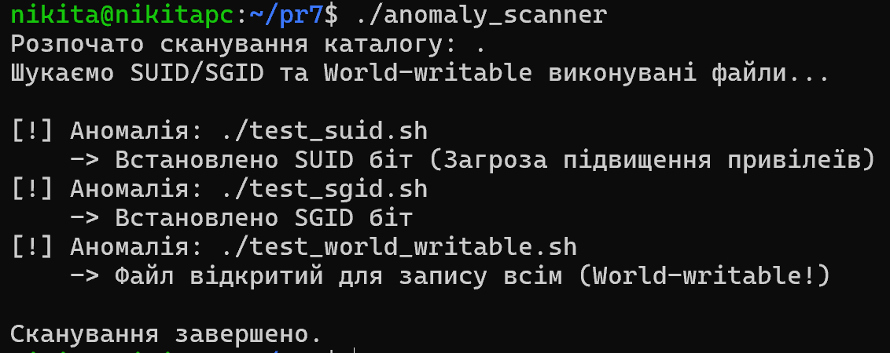

> **Примітка**: після тестування програми обов'язково видаліть ці 3 небезпечні файли!

## Висновки

Ця практика стала глибоким зануренням у системне програмування під UNIX. Я на реальному коді розібрався, як працює управління пам'яттю: побачив механізм оптимізації COW при `fork()` та навчився відловлювати витоки за допомогою Valgrind Massif.

Створення власних міні-аналогів утиліт (`ls`, `grep`, `more`) зруйнувало "магію" командного рядка - тепер я розумію, як працюють системні виклики (`stat`, `opendir`, `popen`) під капотом. А розробка власного сканера аномальних файлів (через `nftw()`) дала крутий практичний досвід у кібербезпеці та пошуку SUID-вразливостей.
