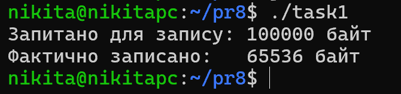
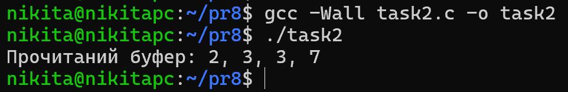
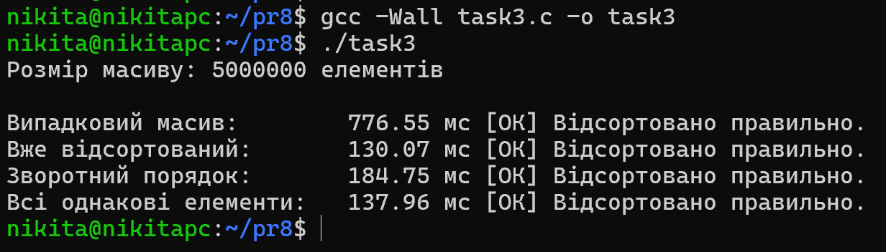
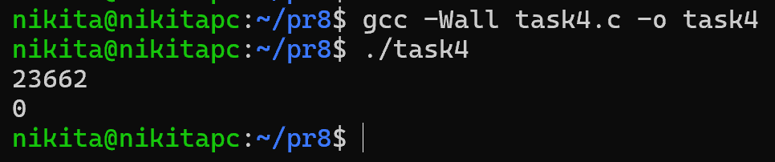
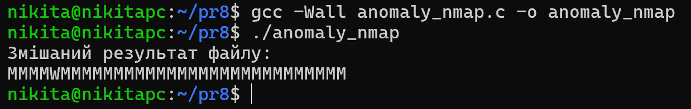

# Практична робота 8

## Загальні завдання

### Завдання 1

> Чи може write() повернути count != nbytes?

**Відповідь**: Так, може. Це називається "частковий запис" (partial write). Це відбувається у кількох випадках:

1. Заповнився дисковий простір або вичерпано квоту користувача.

2. Файл досяг максимального розміру, дозволеного системою.

3. Запис перервався сигналом (наприклад, `SIGALRM`).

4. Запис відбувається у канал (`pipe`) або сокет, і внутрішній буфер системи заповнений.

Програма намагається записати 100 КБ даних у системний канал (`pipe`), який налаштовано у неблокуючий режим. Оскільки розмір буфера каналу в Linux зазвичай становить 64 КБ (65536 байт), `write()` повертає саме це значення, що менше за запитане `nbytes`.

### Завдання 2

**Відповідь**: Оскільки індексація починається з нуля, зміщення на 3 (lseek(fd, 3, SEEK_SET)) встановить покажчик на 4-й елемент.
Масив: [4, 5, 2, 2, 3, 3, 7, 9, 1, 5].
Покажчик стане на число 2 (те, що стоїть на позиції 3). Читання 4 байтів захопить: 2, 3, 3, 7.

Програма демонструє роботу системного виклику `lseek()`. Зміщення `SEEK_SET` на 3 переміщує файловий покажчик на індекс 3 (четвертий байт у файлі). Наступний виклик `read()` успішно зчитує 4 байти, починаючи з цієї позиції, що дає результат: `2, 3, 3, 7`.

### Завдання 3

Утиліта для бенчмаркінгу та тестування стандартної бібліотечної функції `qsort`. Тестуються чотири патерни даних: випадковий масив, вже відсортований, зворотно відсортований та масив однакових елементів (історично — найгірші випадки для QuickSort). Також реалізована функція `test_sort()`, яка автоматично валідує коректність роботи алгоритму.

### Завдання 4

У разі успішного виконання `fork()`, програма розділяється на два паралельні процеси. `fork()` поверне `0` у дочірньому процесі, і PID дочірнього процесу (в мене - `23662`) - у батьківському. Тому програма виведе два числа.

## Завдання по варіантах

### Варіант 13

> _Побудуйте систему, яка перезаписує файл з одночасним використанням mmap() і write() та порівняйте результати._

Програма моделює стан гонки (race condition) між двома механізмами запису. Один процес мапить файл у пам'ять (`mmap`) і записує туди байти 'M', тоді як інший одночасно модифікує той самий файл традиційним системним викликом `pwrite`, записуючи 'W'. Результатом є змішаний рядок. Це доводить, що `mmap` (який працює з кешем сторінок) та `write` синхронізуються ядром на рівні віртуальної файлової системи, але без явних блокувань дані перемішуються.

## Висновки

Під час виконання цієї частини практичної роботи я глибше ознайомився з механізмами вводу-виводу та роботою з даними на рівні операційної системи. Я дослідив поведінку системних викликів `write()` та `lseek()`, зрозумівши, чому запис може бути частковим і як ОС оперує зсувами у файлах.

Я проаналізував швидкодію стандартної бібліотечної функції `qsort`; генерував різні патерни даних і переконався, що сучасні реалізації алгоритму швидкого сортування в Linux (зазвичай IntroSort) чудово оптимізовані та ефективно уникають деградації часу до O(n^2), навіть на зворотно відсортованих масивах чи масивах з однаковими елементами.

Я також штучно створив стан гонки між системним викликом `write()` та відображенням файлу в пам'ять `mmap()`. Це дозволило наочно побачити, як ядро Linux керує синхронізацією кешу сторінок файлу, і переконатися, що без використання файлових блокувань конкурентний запис призводить до передбачуваного перемішування даних.
