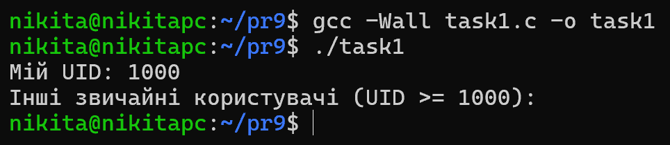
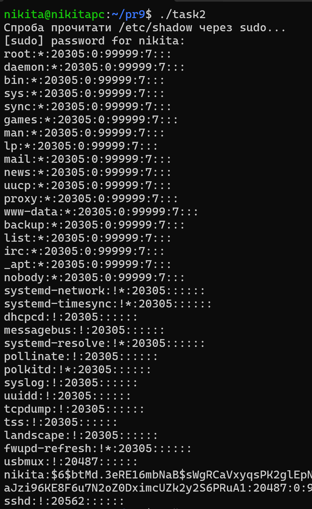
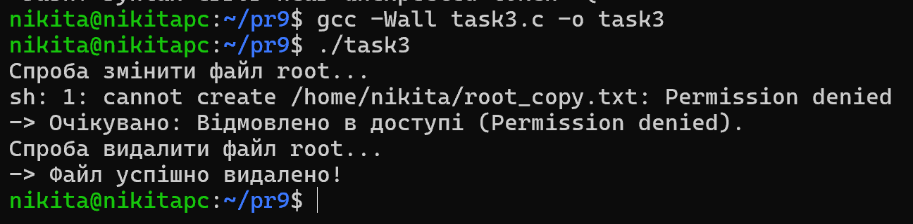
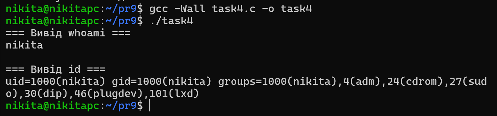
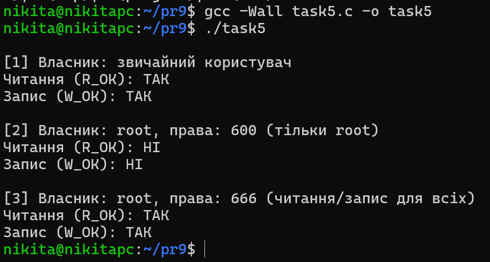
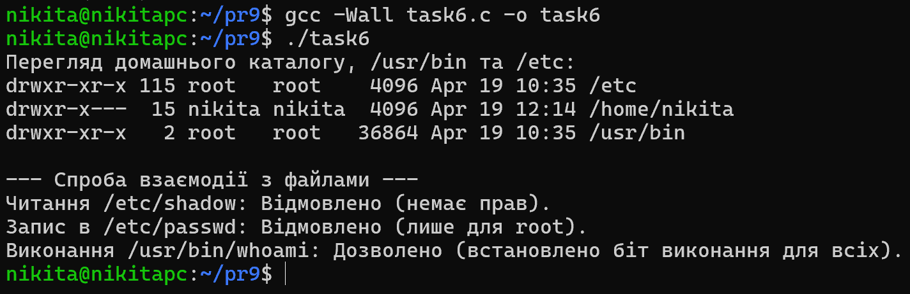
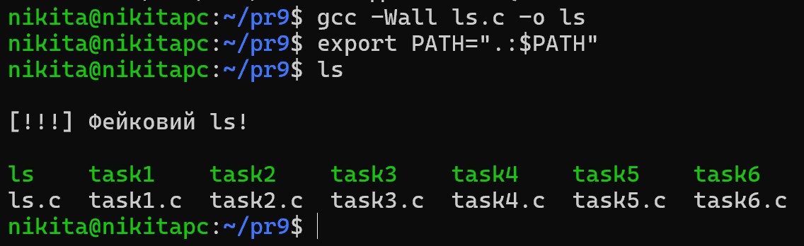
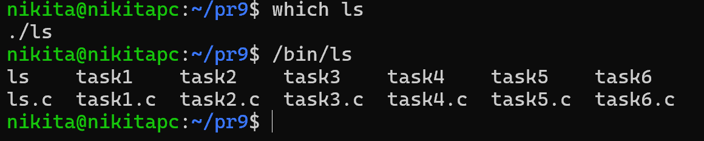

# Практична робота 7

## Загальні завдання

### Завдання 1

Програма використовує функцію `popen()` для виклику команди `getent passwd`. Вона порядково зчитує вивід, розділяє рядки за символом двокрапки за допомогою `strtok()` і отримує UID кожного користувача. Програма ідентифікує "звичайних" користувачів (UID >= 1000) та, використовуючи системний виклик `getuid()`, відфільтровує поточного користувача, виводячи лише інші реальні облікові записи.

### Завдання 2

Цей код демонструє механізм ескалації привілеїв. Оскільки звичайний користувач не має прав на читання `/etc/shadow`, програма використовує `system()` для запуску команди через `sudo`. Якщо конфігурація системи (`/etc/sudoers`) дозволяє користувачу виконувати команди від імені адміністратора, система запитає пароль і виведе хеші паролів.

### Завдання 3

Програма демонструє цікаву особливість прав доступу в UNIX. Спроба модифікувати файл, який належить користувачу `root` (`chown root:root`), завершується помилкою (Permission denied), оскільки функція запису (наприклад, `write()`) перевіряє права самого файлу. Однак спроба видалити файл (`rm`) завершується успіхом. Це відбувається тому, що видалення файлу (системний виклик `unlink()`) вимагає прав на запис до каталогу, в якому лежить файл, а не до самого файлу. Оскільки домашній каталог належить звичайному користувачу, він має право видаляти з нього будь-які об'єкти.

### Завдання 4

За допомогою функції `system()` програма по черзі виконує команди `whoami` та `id`. Утиліта `id` наочно демонструє, що користувач може належати до кількох груп одночасно (наприклад, `sudo`, `docker`, `plugdev`), що визначає його додаткові системні привілеї без необхідності змінювати основний UID.

### Завдання 5

Програма перевіряє права доступу на програмному рівні за допомогою системного виклику `access()`. Спочатку файл створюється від імені звичайного користувача (доступні читання та запис). Потім через `chown` власником стає `root`, а `chmod 600` забороняє доступ іншим - `access()` коректно повертає `-1`. Після `chmod 666` програма знову отримує можливість читати та писати, навіть якщо не є власником файлу, що доводить роботу бітів `Others` у UNIX.

### Завдання 6

Код ілюструє концепцію ієрархії файлової системи Linux. Системні каталоги `/etc` та `/usr/bin` належать `root`. Програма показує, що хоча ми можемо читати вміст деяких конфігурацій (наприклад, `/etc/passwd`), спроба отримати доступ до критичних файлів (`/etc/shadow`) через функцію `access()` завершується відмовою. Водночас програми в `/usr/bin` доступні для запуску (`X_OK`), бо їхні права (зазвичай `755`) дозволяють виконання всім користувачам.

## Завдання по варіантах

### Варіант 13

> _Створіть "обманну" програму, яка виглядає як ls, але виконує інші дії. Як її виявити?_

Реалізовано "троянську" програму, яка імітує утиліту `ls`. Вона використовує перехоплення змінної середовища `$PATH`. Коли користувач вводить `ls`, оболонка знаходить підробний бінарник раніше за справжній. Програма виконує "шкідливу" дію, а потім викликає системну функцію `execv("/bin/ls")`, передаючи їй усі аргументи командного рядка, щоб симулювати звичайну роботу.

_Щоб вона спрацювала, програму треба скомпілювати як `gcc ls.c -o ls` і додати поточний каталог на початок шляху: `export PATH=".:$PATH"`._

Коли введемо `ls`, запуститься саме наш троян:

**Як виявити?**

1. Використати команду type ls або which ls - вони покажуть підозрілий шлях.
2. Запустити утиліту з вказанням абсолютного шляху: /bin/ls. Якщо вона працює нормально, а просто ls ні — значить, команду перехоплено через $PATH або alias.

## Висновки

Під час виконання практичної роботи я дослідив систему управління користувачами та правами доступу в UNIX. Через створення C-програм з використанням викликів `system()`, `popen()`, та `access()`, я розібрався, як ОС розділяє привілеї між звичайними користувачами та `root`. Було наочно продемонстровано, що можливість модифікації файлу залежить від його прав доступу, тоді як можливість його видалення (`rm`) визначається виключно правами на каталог, у якому він лежить.

Створення підробленої утиліти `ls` дозволило зрозуміти як працюють атаки через змінну оточення `$PATH` та методи їх виявлення, що є важливим аспектом системної безпеки.
